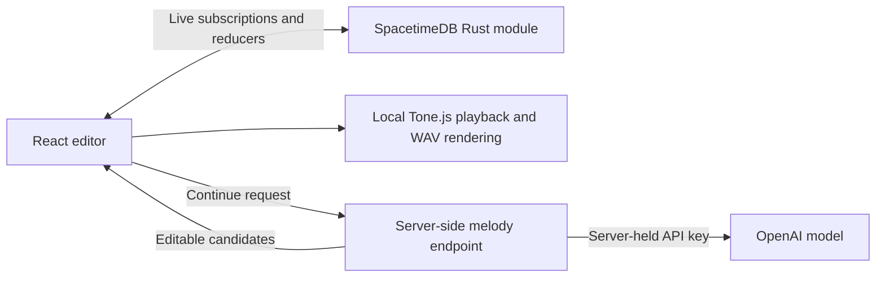

# JamSpace

**A collaborative music workspace for turning a first idea into a shared, listenable sketch.**

[Try the JamSpace 1.1 beta](https://jamspace-v11-geolexxx.vercel.app/) · [Read the 1.1 product brief](docs/JamSpace_1.1_PRD.md) · [Explore the AI workflow](docs/JamSpace_AI_Jam_Partner_PRD.md)

JamSpace is a browser-based step sequencer where people can edit the same project in real time. Version 1.1 adds a project workspace, active collaborator presence, WAV export, and **Continue my melody**: an AI workflow that turns an initial bar into four more editable bars across Drums, Bass, Synth, and Lead.

**My role in 1.1:** solo full stack developer. I defined the product scope, designed the workflow, built the React client and Rust/SpacetimeDB changes, integrated the model service, and deployed the beta. This README describes the working prototype and the product choices behind it; the linked PRDs describe a broader target state.

## The problem

A small group can quickly sketch one musical bar, but moving from that bar to a complete phrase takes repetitive editing. Collaboration adds another hurdle: people need to find the right project, see who is working, and leave with something they can play outside the editor.

JamSpace tests a simple loop for **2–4 people making a short musical sketch**:

1. Start a project and invite someone into the same editable session.
2. Build an idea together, or ask AI to continue it and choose what to keep.
3. Arrange the result and export a WAV file.

The user need and the impact of each feature are product hypotheses, not measured outcomes yet.

## Try the prototype

1. Open the [live beta](https://jamspace-v11-geolexxx.vercel.app/), enter a stage name, and create a project.
2. Add notes to a track. Use **Invite** to copy the editor link, then open it in a second browser; both browsers should see edits and active collaborators.
3. Use **Continue my melody** after writing a bar. Enter the private testing code if you have one, audition three four-bar candidates, then apply the one you want to edit further.
4. Arrange your patterns in the Song view and use **Export** to download a WAV file.

**Prototype access boundary:** projects are visible on the workspace home and editable by anyone who opens them. An editor link is a convenient entry point, not a private invitation. Do not put confidential material here. AI use is gated by a shared testing code; the site has no per-user AI quota.

## What shipped in 1.1

| User job | Working prototype |
| --- | --- |
| Find a place to create | Project workspace with create, search, and project entry |
| Make music together | Shared note, pattern, arrangement, tempo, and track edits; active collaborator presence |
| Move past the first bar | Three AI-generated, four-bar candidates covering Drums, Bass, Synth, and Lead |
| Keep creative control | Private candidate audition and an explicit **Apply** step; accepted notes remain editable |
| Take the work elsewhere | Browser-rendered WAV export of the current Song arrangement |

The sequencer uses four default instruments, reusable patterns, and an arrangement timeline. Each browser renders audio locally from the shared project state. Shared play/pause and BPM are implemented; sample-accurate listening across browsers has not been measured.

## Product decisions

| Decision | Why it matters | Current tradeoff |
| --- | --- | --- |
| Share editable music data instead of an audio stream | Collaborators can change individual notes and build on the same arrangement | Each browser renders its own audio; synchronized controls do not prove synchronized sound |
| Generate **candidates**, then let the user audition and apply one | AI helps finish a phrase while the user chooses and edits the result | Suggestions are temporary until accepted; there is no one-click undo for an entire accepted candidate |
| Continue all four instruments | A full phrase is more useful to hear than an isolated synth line | Model quality across different musical styles still needs user testing |
| Export a snapshot taken when the user clicks Download | Later collaborator edits cannot silently change the file being rendered | Export is WAV only, with a five-minute limit |

The AI request uses the latest occupied bar and up to four preceding bars as context. A candidate is previewed only in the requesting browser. On **Apply**, a SpacetimeDB reducer rechecks the source and destination before writing the four-track result in one transaction; a conflicting edit rejects the apply instead of overwriting another person's notes.

WAV export produces 44.1 kHz, 16-bit stereo PCM from the current Song arrangement. Shared track mute and volume settings are reflected in the file. See [audio export notes and sample credits](docs/audio-export.md).

## What is still open

The [1.1 PRD](docs/JamSpace_1.1_PRD.md) is a target-state document, not a claim that every requirement shipped. Its earlier single-track AI requirements also predate the current four-instrument implementation.

| Priority for a wider release | Work remaining |
| --- | --- |
| Access and cost control | Private projects, server-enforced roles, revocable invitations, authenticated AI quotas, and rate limiting |
| Product validation | Observe two-person project completion, time from first bar to an auditionable phrase, AI candidate acceptance, export reliability, and model quality |
| Delivery | Immutable, listener-only published versions and revocable listening links |
| Music workflow | Whole-candidate undo and broader export options |

No adoption, retention, model-quality, or time-saved result is reported here. The proposed success metrics in the PRD are evaluation targets, not achieved results.

## How it works



SpacetimeDB stores sessions, tracks, patterns, arrangement blocks, notes, and presence. Clients subscribe to the shared tables and call reducers for writes. The production AI endpoint keeps the OpenAI key on the server and requires a separate testing code. Production builds point to the fresh `jamspace-v11-geolexxx` MainCloud database; it does not contain projects from the older JamSpace site.

### Repository map

| Path | Purpose |
| --- | --- |
| [`client/`](client/) | React, TypeScript, Vite editor; local audio, WAV export, and Vercel melody endpoint |
| [`server/`](server/) | SpacetimeDB Rust schema and reducers |
| [`ai-service/`](ai-service/) | Local Node service for model-backed development |
| [`docs/`](docs/) | Product requirements, AI workflow, and audio export notes |

### Run locally

Use Node.js 20+ and the SpacetimeDB CLI. The checked-in client bindings come from the server schema. From the repository root, start the local database in one terminal:

```bash
spacetime start
```

In a second terminal, publish the server module and start the client:

```bash
cd server && spacetime publish --server local jamspace
cd ../client && npm ci && VITE_STDB_URI=ws://127.0.0.1:3000 VITE_MODULE_NAME=jamspace npm run dev
```

For model-backed continuation, set `OPENAI_API_KEY` only in the local service's environment, then run `cd ai-service && npm start` from the repository root in another terminal. Vite forwards `/api` to that service on `127.0.0.1:8787`. Never put the API key in a `VITE_` variable or commit it. The feature reports an error when the service or key is unavailable.

After a server schema change, regenerate TypeScript bindings from the repository root with:

```bash
spacetime generate --lang typescript --out-dir client/src/module_bindings --project-path server
```

The 1.1 beta is deployed separately on Vercel. Its production AI endpoint needs server-side `OPENAI_API_KEY` and `JAMSPACE_AI_ACCESS_CODE`; changing those settings requires a new deployment. The local development service is not a public API and should not be exposed as one.

---

JamSpace 1.1 is a working prototype and a product case study. Its open workspace is intended for testing, not private collaboration.
